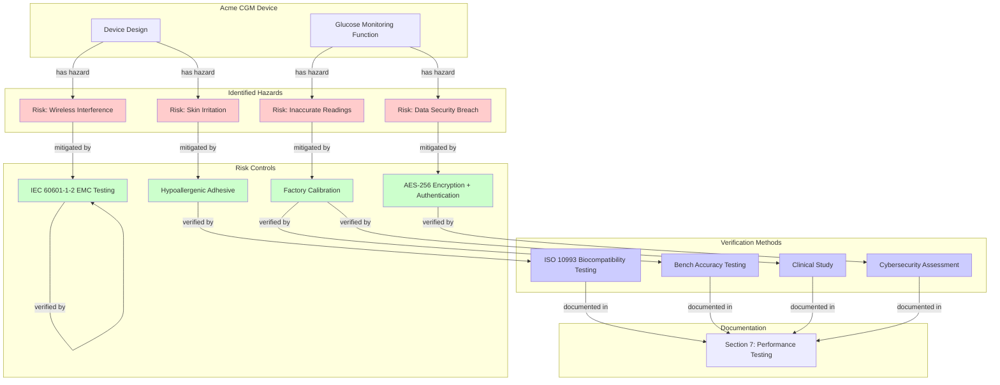
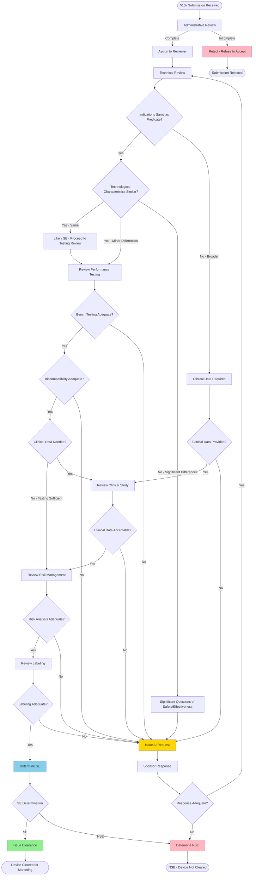

Skill 9: AI Magic Tools Suite - Five Regulatory Document Enhancement Tools
ai-magic-tools-suite
Description
Comprehensive suite of five specialized AI "Magic" tools designed to enhance regulatory documents and notes with specific transformations: formatting beautification, keyword highlighting with custom colors, action item extraction, concept map generation, and glossary creation. Each Magic tool applies targeted AI processing to add value and structure to existing content.
Magic Tool Overview
Magic NameFunctionPrimary OutputMagic 1: FormatTransform messy text into clean, professional markdown with proper structureBeautifully formatted markdown documentMagic 2: KeywordsExtract and highlight key regulatory terms with custom color codingAnnotated document with colored keywordsMagic 3: Action ItemsIdentify and extract actionable tasks with priority levels and checkboxesStructured action item checklistMagic 4: Concept MapGenerate visual concept relationship diagrams in Mermaid markdownInteractive concept map diagramMagic 5: GlossaryCreate comprehensive glossary of technical and regulatory termsAlphabetized glossary with definitions

Magic 1: Format Beautification & Structure Enhancement
Description
Transforms poorly formatted, messy, or plain text documents into clean, professional markdown with proper heading hierarchy, bullet points, tables, emphasis, code blocks, and consistent styling suitable for regulatory documentation.
Capabilities

Heading Detection & Hierarchy: Identify document structure and apply H1-H6 headings appropriately
List Formatting: Convert informal lists into proper markdown bullets or numbered lists
Table Creation: Detect tabular data and format as markdown tables
Emphasis Application: Add bold and italic for key terms and important points
Quote Block Formatting: Format citations and references as blockquotes
Code Block Handling: Wrap technical content in appropriate code fences
Paragraph Organization: Add proper spacing and line breaks
Section Dividers: Insert horizontal rules (---) between major sections
Consistency Enforcement: Standardize punctuation, spacing, and capitalization
Link Formatting: Convert URLs to proper markdown links

Before & After Examples
Before (Messy Text):
Copy510K REVIEW NOTES
the device is acme cgm for t2dm patients
INDICATION same as predicate k123456

testing results
bench testing passed all specs, accuracy +/-10mg/dl
biocompatibility - iso10993-1 tests done, see section8
clinical study: N=50, results: 98percent within +/-15percent criteria!!!

RISKS: skin irritation (low), inaccurate readings(medium), wireless interference(low)
mitigations: hypoallergenic adhesive, factory calibration, iec60601-1-2 testing

recommendation: SE clearance
After (Formatted Markdown):
markdownCopy# 510(k) Review Notes

## Device Overview
The device is the **Acme CGM** (Continuous Glucose Monitor), indicated for use in **Type 2 diabetes mellitus (T2DM) patients**.

**Indication**: Same as predicate device K123456

---

## Testing Results

### Bench Testing
- **Status**: Passed all specifications
- **Accuracy**: ±10 mg/dL

### Biocompatibility
- **Standard**: ISO 10993-1 testing completed
- **Documentation**: See Section 8 for detailed test reports

### Clinical Study
- **Sample Size**: N = 50 patients
- **Primary Endpoint**: Accuracy within ±15% of reference
- **Results**: **98% of readings met acceptance criteria** ✓

---

## Risk Management

| Risk | Severity | Mitigation |
|------|----------|------------|
| Skin irritation | Low | Hypoallergenic adhesive selection |
| Inaccurate readings | Medium | Factory calibration (no user calibration required) |
| Wireless interference | Low | IEC 60601-1-2 electromagnetic compatibility testing |

---

## Recommendation

**Substantial Equivalence (SE) - Clearance Recommended** ✓
Use Cases

Clean up hastily typed review notes
Format copy-pasted content from PDFs or emails
Prepare informal notes for formal documentation
Standardize formatting across multiple reviewer notes
Convert plain text protocols into structured markdown

MANDATORY TRIGGERS
format document, beautify text, clean formatting, markdown formatting, format magic, improve formatting, structure document, organize text, format beautification, apply formatting

Magic 2: Keyword Extraction & Color-Coded Highlighting
Description
Intelligently extracts key regulatory terms, device names, standards, risks, tests, and critical concepts from documents and highlights them with customizable color coding to enable quick visual scanning and identification of important information.
Capabilities

Multi-Category Keyword Detection: Extract 8+ keyword categories
Custom Color Assignment: Apply user-selected colors to keyword categories
Inline Highlighting: Insert HTML color spans within markdown
Keyword Frequency Analysis: Count occurrences of each keyword
Context Preservation: Maintain original document structure while highlighting
Priority Keyword Flagging: Mark highest-priority terms
Acronym Expansion: Link acronyms to full terms
Cross-Reference Creation: Link related keywords
Export with Legend: Include color legend for keyword categories

Keyword Categories & Default Colors
CategoryExamplesDefault ColorHTML CodeDevice Names"Acme CGM", "PredCGM System"🟦 Blue#4A90E2Regulatory Terms"510(k)", "Substantial Equivalence", "NSE"🟪 Purple#9B59B6Standards"ISO 10993-1", "IEC 60601-1", "ASTM F2150"🟩 Green#27AE60Risks/Hazards"skin irritation", "inaccurate readings"🟥 Red#E74C3CTests/Methods"bench testing", "clinical study", "biocompatibility"🟨 Yellow#F39C12Acceptance Criteria"±15%", "≥95%", "Pass/Fail"🟧 Orange#E67E22Findings/Results"Pass", "Acceptable", "Deficiency"🟫 Brown#8B4513Action Items"Review", "Verify", "Request additional info"⬛ Dark Gray#34495E
Output Format Example
markdownCopy# 510(k) Review: <span style="color:#4A90E2">**Acme CGM**</span>

## Device Overview
The <span style="color:#4A90E2">**Acme Continuous Glucose Monitor**</span> is a Class II device 
submitted under <span style="color:#9B59B6">**510(k) number K123456**</span>. The device is indicated 
for monitoring in adult patients with Type 2 diabetes.

## Testing Summary
<span style="color:#F39C12">**Bench testing**</span> was conducted per 
<span style="color:#27AE60">**ISO 15197:2013**</span>. 
<span style="color:#E67E22">**Accuracy acceptance criteria: ±15%**</span>. 
Results: <span style="color:#8B4513">**98% Pass**</span> ✓

## Risk Management
Identified <span style="color:#E74C3C">**risk: skin irritation**</span> with severity rating of Medium. 
<span style="color:#F39C12">**Biocompatibility testing**</span> per 
<span style="color:#27AE60">**ISO 10993-1**</span> conducted. 
Result: <span style="color:#8B4513">**Acceptable**</span> ✓

## Outstanding Items
<span style="color:#34495E">**Action: Review software V&V documentation (Section 7)**</span>

---

## Keyword Legend

🟦 **Device Names** (3 occurrences): Acme CGM, Acme Continuous Glucose Monitor, PredCGM  
🟪 **Regulatory Terms** (5 occurrences): 510(k), K123456, Class II, Substantial Equivalence, SE  
🟩 **Standards** (4 occurrences): ISO 15197:2013, ISO 10993-1, IEC 60601-1, ISO 14971  
🟥 **Risks** (2 occurrences): skin irritation, inaccurate readings  
🟨 **Tests** (3 occurrences): bench testing, biocompatibility testing, clinical study  
🟧 **Criteria** (2 occurrences): ±15%, ≥95%  
🟫 **Findings** (4 occurrences): Pass, Acceptable, SE, Clearance  
⬛ **Actions** (1 occurrence): Review software V&V  

**Total Keywords Highlighted**: 24
Customization Options

User can select custom colors for each category
Adjustable sensitivity (extract more or fewer keywords)
Category filtering (only highlight certain categories)
Export options (HTML with inline styles, markdown with color codes, plain markdown)

Use Cases

Quick visual scanning of lengthy review memos
Highlighting key terms in FDA guidance documents
Creating color-coded study materials for training
Emphasizing critical findings in audit reports
Preparing executive summaries with visual emphasis

MANDATORY TRIGGERS
keyword extraction, highlight keywords, color coding, extract key terms, keyword magic, highlight important, color highlight, term extraction, keyword analysis, identify keywords

Magic 3: Action Item Extractor & Task List Generator
Description
Automatically scans documents to identify and extract all actionable tasks, follow-up items, questions requiring answers, and deliverables. Generates a comprehensive, prioritized checklist with checkboxes, assignees, deadlines, and status tracking.
Capabilities

Action Verb Detection: Identify tasks starting with "Review", "Verify", "Check", "Request", etc.
Question Extraction: Find interrogative sentences requiring follow-up
Deadline Detection: Extract due dates and timelines
Priority Assignment: Auto-assign priority (High/Medium/Low) based on context
Assignee Identification: Detect responsible parties if mentioned
Status Tracking: Include status fields (Not Started/In Progress/Complete)
Dependency Mapping: Link related tasks
Categorization: Group by review area or topic
Checkbox Formatting: Create interactive markdown checkboxes
Export Options: Generate standalone task list or integrated tracking table

Action Item Detection Patterns
Explicit Action Items:

"TODO: [action]"
"Action: [action]"
"Need to [action]"
"Must [action]"
"Should [action]"
"[ ] [action]"

Implicit Action Items:

Questions: "Has the sponsor provided...?" → Action: "Verify sponsor provided X"
Concerns: "The labeling may be inadequate" → Action: "Review labeling adequacy"
Gaps: "Software V&V documentation not yet reviewed" → Action: "Review software V&V"
Requests: "Additional data required" → Action: "Request additional data from sponsor"

Output Format
markdownCopy# Action Item List
**Document Source**: 510(k) Review Memo - Acme CGM
**Extraction Date**: February 15, 2024
**Total Action Items Identified**: 12

---

## High Priority Action Items (5)

### ITEM-001: Review Software Verification & Validation Documentation
- **Priority**: 🔴 HIGH
- **Category**: Performance Testing
- **Description**: Review the 500-page software V&V documentation in Section 7 to verify adequate software development lifecycle compliance per FDA Software Guidance.
- **Assignee**: Software Reviewer
- **Estimated Effort**: 8-12 hours
- **Due Date**: February 20, 2024
- **Status**: ⏳ Not Started
- **Dependencies**: None
- **Checkbox**: - [ ] Complete software V&V review

**Notes**: This is a critical review item as software is a key differentiating feature from the predicate.

---

### ITEM-002: Verify IEC 60601-1-2 Wireless Coexistence Testing
- **Priority**: 🔴 HIGH
- **Category**: Performance Testing
- **Description**: Verify that electromagnetic compatibility and wireless coexistence testing per IEC 60601-1-2:2014 was completed. Review test protocols and reports.
- **Assignee**: Electrical Engineer Reviewer
- **Estimated Effort**: 3-4 hours
- **Due Date**: February 18, 2024
- **Status**: ⏳ Not Started
- **Dependencies**: None
- **Checkbox**: - [ ] Verify IEC 60601-1-2 testing complete

**Notes**: Wireless communication is a potential interference risk that must be adequately tested.

---

### ITEM-003: Confirm Predicate Device Comparison Table Completeness
- **Priority**: 🔴 HIGH
- **Category**: Technological Characteristics
- **Description**: Review the predicate comparison table (Submission Table 3-1, p.22) to ensure all technological characteristics are compared and all differences are adequately explained.
- **Assignee**: Lead Reviewer
- **Estimated Effort**: 2 hours
- **Due Date**: February 17, 2024
- **Status**: ⏳ Not Started
- **Dependencies**: None
- **Checkbox**: - [ ] Confirm comparison table completeness

**Notes**: Incomplete comparison is a common deficiency leading to AI requests.

---

### ITEM-004: Verify ISO 10993-1 Biocompatibility Test Battery Appropriateness
- **Priority**: 🔴 HIGH
- **Category**: Biocompatibility
- **Description**: Confirm that the biocompatibility test battery matches ISO 10993-1:2018 Table A.1 requirements for prolonged skin contact (>24hr, ≤30 days). Review test reports in Section 8.
- **Assignee**: Biocompatibility Specialist
- **Estimated Effort**: 2-3 hours
- **Due Date**: February 18, 2024
- **Status**: ⏳ Not Started
- **Dependencies**: None
- **Checkbox**: - [ ] Verify appropriate ISO 10993-1 test battery

---

### ITEM-005: Request Clarification on Pediatric Use Plans
- **Priority**: 🔴 HIGH (if considering future pediatric indication)
- **Category**: Indications for Use
- **Description**: Send question to sponsor: "Has the device been tested for pediatric use, or is there potential for future pediatric indication expansion?" Current indication is adults only, but pediatric diabetes is an important clinical need.
- **Assignee**: Lead Reviewer
- **Estimated Effort**: 1 hour (draft question)
- **Due Date**: February 19, 2024
- **Status**: ⏳ Not Started
- **Dependencies**: None
- **Checkbox**: - [ ] Draft and send pediatric use question to sponsor

**Notes**: If sponsor is considering pediatric expansion, discussing now may prevent need for new 510(k) later.

---

## Medium Priority Action Items (4)

### ITEM-006: Review Clinical Study Statistical Analysis Methodology
- **Priority**: 🟡 MEDIUM
- **Category**: Clinical Performance
- **Description**: Review the statistical analysis methodology for the 50-patient clinical study. Verify appropriate sample size calculation, endpoint selection, and statistical tests.
- **Assignee**: Clinical Reviewer
- **Estimated Effort**: 3-4 hours
- **Due Date**: February 21, 2024
- **Status**: ⏳ Not Started
- **Checkbox**: - [ ] Review clinical statistical analysis

---

### ITEM-007: Assess Labeling Adequacy for MRI Incompatibility Warning
- **Priority**: 🟡 MEDIUM
- **Category**: Labeling
- **Description**: Verify that the Instructions for Use (IFU) contain clear, prominent warnings about MRI incompatibility and the need to remove the device before MRI procedures.
- **Assignee**: Labeling Reviewer
- **Estimated Effort**: 1 hour
- **Due Date**: February 20, 2024
- **Status**: ⏳ Not Started
- **Checkbox**: - [ ] Verify MRI warning adequacy in IFU

---

### ITEM-008: Review Cybersecurity Controls Documentation
- **Priority**: 🟡 MEDIUM
- **Category**: Cybersecurity
- **Description**: Review cybersecurity documentation per FDA 2014 Cybersecurity Guidance. Verify threat modeling, security controls (encryption, authentication), and vulnerability management plan.
- **Assignee**: Cybersecurity Specialist
- **Estimated Effort**: 4-5 hours
- **Due Date**: February 22, 2024
- **Status**: ⏳ Not Started
- **Checkbox**: - [ ] Review cybersecurity documentation

---

### ITEM-009: Verify Shelf Life and Stability Testing Adequacy
- **Priority**: 🟡 MEDIUM
- **Category**: Performance Testing
- **Description**: Review shelf life validation and real-time stability testing data. Confirm that claimed shelf life is supported by data.
- **Assignee**: Materials Reviewer
- **Estimated Effort**: 2 hours
- **Due Date**: February 21, 2024
- **Status**: ⏳ Not Started
- **Checkbox**: - [ ] Verify shelf life testing adequacy

---

## Low Priority Action Items (3)

### ITEM-010: Update Internal Tracking Database
- **Priority**: 🟢 LOW
- **Category**: Administrative
- **Description**: Update the division's 510(k) tracking database with key milestones for K123456.
- **Assignee**: Administrative Staff
- **Estimated Effort**: 15 minutes
- **Due Date**: February 23, 2024
- **Status**: ⏳ Not Started
- **Checkbox**: - [ ] Update tracking database

---

### ITEM-011: Prepare Team Meeting Agenda for Review Discussion
- **Priority**: 🟢 LOW
- **Category**: Administrative
- **Description**: Prepare agenda for team discussion of Acme CGM review findings scheduled for February 24.
- **Assignee**: Lead Reviewer
- **Estimated Effort**: 30 minutes
- **Due Date**: February 23, 2024
- **Status**: ⏳ Not Started
- **Checkbox**: - [ ] Prepare team meeting agenda

---

### ITEM-012: Archive Review Session Notes
- **Priority**: 🟢 LOW
- **Category**: Administrative
- **Description**: Archive all review session notes and supporting documents in the division's document management system.
- **Assignee**: Lead Reviewer
- **Estimated Effort**: 20 minutes
- **Due Date**: February 25, 2024
- **Status**: ⏳ Not Started
- **Checkbox**: - [ ] Archive review materials

---

## Action Item Summary Table

| ID | Action | Priority | Assignee | Due Date | Status |
|----|--------|----------|----------|----------|--------|
| 001 | Review Software V&V | 🔴 HIGH | Software Reviewer | 02/20 | ⏳ Not Started |
| 002 | Verify IEC 60601-1-2 | 🔴 HIGH | Electrical Engineer | 02/18 | ⏳ Not Started |
| 003 | Confirm Predicate Comparison | 🔴 HIGH | Lead Reviewer | 02/17 | ⏳ Not Started |
| 004 | Verify ISO 10993-1 Battery | 🔴 HIGH | Biocompatibility Specialist | 02/18 | ⏳ Not Started |
| 005 | Pediatric Use Question | 🔴 HIGH | Lead Reviewer | 02/19 | ⏳ Not Started |
| 006 | Clinical Statistical Review | 🟡 MEDIUM | Clinical Reviewer | 02/21 | ⏳ Not Started |
| 007 | MRI Warning Review | 🟡 MEDIUM | Labeling Reviewer | 02/20 | ⏳ Not Started |
| 008 | Cybersecurity Review | 🟡 MEDIUM | Cybersecurity Specialist | 02/22 | ⏳ Not Started |
| 009 | Shelf Life Verification | 🟡 MEDIUM | Materials Reviewer | 02/21 | ⏳ Not Started |
| 010 | Update Tracking Database | 🟢 LOW | Administrative Staff | 02/23 | ⏳ Not Started |
| 011 | Prepare Meeting Agenda | 🟢 LOW | Lead Reviewer | 02/23 | ⏳ Not Started |
| 012 | Archive Materials | 🟢 LOW | Lead Reviewer | 02/25 | ⏳ Not Started |

---

## Quick Copy Checklist (All Items)

- [ ] Review Software V&V (HIGH - Due 02/20)
- [ ] Verify IEC 60601-1-2 (HIGH - Due 02/18)
- [ ] Confirm Predicate Comparison (HIGH - Due 02/17)
- [ ] Verify ISO 10993-1 Battery (HIGH - Due 02/18)
- [ ] Pediatric Use Question (HIGH - Due 02/19)
- [ ] Clinical Statistical Review (MEDIUM - Due 02/21)
- [ ] MRI Warning Review (MEDIUM - Due 02/20)
- [ ] Cybersecurity Review (MEDIUM - Due 02/22)
- [ ] Shelf Life Verification (MEDIUM - Due 02/21)
- [ ] Update Tracking Database (LOW - Due 02/23)
- [ ] Prepare Meeting Agenda (LOW - Due 02/23)
- [ ] Archive Materials (LOW - Due 02/25)
Use Cases

Extract tasks from review memos for project tracking
Convert meeting minutes into actionable task lists
Identify outstanding items from FDA deficiency letters
Create punch lists from audit findings
Generate follow-up task lists from sponsor teleconferences

MANDATORY TRIGGERS
action items, extract actions, task list, TODO list, action extraction, identify tasks, find action items, extract tasks, action item magic, task extraction, to-do extraction

Magic 4: Concept Map Generator (Mermaid Diagram)
Description
Analyzes document content to identify key concepts, entities, and their relationships, then automatically generates interactive visual concept maps in Mermaid markdown format. Perfect for visualizing complex regulatory relationships, device ecosystems, risk-control chains, and review workflows.
Capabilities

Entity Extraction: Identify all major concepts (devices, risks, tests, standards, etc.)
Relationship Detection: Determine how concepts relate (causes, mitigates, requires, demonstrates, etc.)
Hierarchy Recognition: Detect parent-child and part-whole relationships
Flow Mapping: Trace processes and workflows
Mermaid Syntax Generation: Create valid Mermaid markdown diagrams
Multiple Diagram Types: Generate flowcharts, mind maps, entity-relationship diagrams, sequence diagrams
Color Coding: Apply colors to node categories
Interactive Output: Mermaid diagrams are render-able in markdown viewers
Legend Creation: Add legend for node types and relationships

Mermaid Diagram Types Supported
Diagram TypeUse CaseExampleFlowchartProcess flows, decision trees510(k) review workflowMind MapConcept hierarchiesDevice risk taxonomyEntity-RelationshipComponent relationshipsDevice system architectureSequenceTemporal interactionsSponsor-FDA communication flowGraphNetwork relationshipsRisk-mitigation mappings
Example Output: Risk-Mitigation Concept Map
Input Document (Excerpt):
CopyThe device has several identified risks:
1. Skin irritation from adhesive - mitigated by ISO 10993 biocompatibility testing and hypoallergenic adhesive selection
2. Inaccurate glucose readings - mitigated by factory calibration and extensive accuracy testing (bench + clinical)
3. Wireless interference - mitigated by IEC 60601-1-2 EMC testing
4. Data security breach - mitigated by AES-256 encryption and user authentication

All mitigations are verified through performance testing documented in Section 7.
Output Mermaid Diagram:
markdownCopy## Concept Map: Risk Management & Mitigation Strategy



**Legend**:
- 🔴 Red Nodes: Identified Risks/Hazards
- 🟢 Green Nodes: Risk Control Measures
- 🔵 Blue Nodes: Verification/Testing Methods
- ⬜ White Nodes: Device Components/Documentation

**Concept Map Insights**:
- **Total Risks Identified**: 4
- **Total Mitigations**: 4
- **Verification Methods**: 4
- **Risk-Control Coverage**: 100% (all risks have controls)
- **All Controls Verified**: Yes (all mitigations tested/assessed)
Example Output: 510(k) Review Workflow
markdownCopy## Concept Map: 510(k) Review Process Flow



**Process Insights**:
- **Total Decision Points**: 9
- **Potential AI Requests**: 6 decision points may trigger AI
- **Critical Path**: Indications → Tech Comparison → Testing → Risk → Labeling → SE Decision
- **Success Path**: Green boxes indicate clearance pathway
- **Failure Points**: Red boxes indicate rejection/NSE outcomes
- **AI Loops**: Yellow boxes indicate additional information requests (can cycle multiple times)
Use Cases

Visualize complex risk-mitigation chains
Map 510(k) review decision workflows
Diagram device system architecture and components
Illustrate test-verification-documentation relationships
Create visual training materials for new reviewers
Present review strategies in team meetings

MANDATORY TRIGGERS
concept map, create diagram, generate map, mermaid diagram, visual map, relationship diagram, concept visualization, flow diagram, entity map, create flowchart, mind map

Magic 5: Glossary Generator for Technical & Regulatory Terms
Description
Automatically identifies technical terms, regulatory acronyms, standards, device names, and specialized jargon in documents, then generates a comprehensive alphabetized glossary with clear, context-appropriate definitions suitable for regulatory audiences.
Capabilities

Term Identification: Detect technical terms, acronyms, standards, and jargon
Context-Aware Definitions: Generate definitions appropriate to regulatory/medical device context
Acronym Expansion: Provide full forms of abbreviations
Standard Explanations: Describe referenced standards (ISO, IEC, ASTM, FDA guidance)
Cross-Referencing: Link related terms
Alphabetization: Sort terms A-Z for easy lookup
Usage Frequency: Show how often each term appears
Source Citation: Reference where terms are defined in source documents
Multilingual Support: Generate glossaries in English or Traditional Chinese
Export Options: Standalone glossary or appendix format

Term Categories Detected
CategoryExamplesAcronymsCGM, T2DM, IFU, SE, NSE, AI, EMC, V&VRegulatory Terms510(k), Predicate Device, Substantial Equivalence, Not Substantially Equivalent, ClearanceStandardsISO 10993-1, IEC 60601-1, ASTM F2150, ISO 14971Technical TermsElectrochemical sensor, Glucose oxidase, Amperometric detection, Interstitial fluidClinical TermsType 2 Diabetes Mellitus, Hypoglycemia, Hyperglycemia, Glycemic controlTesting MethodsBench testing, Biocompatibility testing, Clinical study, V&V, EMC testingDevice ComponentsTransmitter, Sensor, Adhesive, Electrode, Smartphone applicationRisk TermsHazard, Severity, Probability, Residual risk, Risk control
Example Output
markdownCopy# Glossary of Terms
**Document Source**: 510(k) Review Memo - Acme CGM (K123456)
**Total Terms**: 47
**Generation Date**: February 15, 2024

---

## A

**Acceptance Criteria**  
Predetermined standards that a device or test must meet to be considered acceptable. In 510(k) submissions, acceptance criteria are specified for performance testing (e.g., "≥95% of readings within ±15% of reference"). Failure to meet acceptance criteria may indicate a deficiency requiring additional testing or design modifications.  
*Frequency: 8 occurrences*

**Acme CGM**  
Trade name for the subject device: Acme Continuous Glucose Monitor. A Class II medical device intended for continuous monitoring of interstitial fluid glucose levels in adult patients with Type 2 diabetes mellitus.  
*Frequency: 23 occurrences*

**Adhesive**  
A biocompatible substance used to attach the CGM sensor to the patient's skin. The subject device uses a medical-grade hypoallergenic acrylic adhesive tested per ISO 10993-10 for skin sensitization and irritation. Adhesive selection is critical to minimize risk of contact dermatitis during prolonged wear (up to 14 days).  
*Frequency: 12 occurrences*  
*Related Terms: Biocompatibility, ISO 10993-10, Skin Irritation*

**AI (Additional Information)**  
An FDA request for additional information sent to a sponsor when a 510(k) submission is deficient or incomplete. AI requests specify deficiencies and provide the sponsor an opportunity to submit additional data or clarifications. Also called a "deficiency letter."  
*Frequency: 5 occurrences*  
*Related Terms: Deficiency, Hold*

**Amperometric Detection**  
An electrochemical measurement technique that quantifies analyte concentration by measuring electric current produced by oxidation or reduction reactions. In glucose sensors, glucose oxidase catalyzes glucose oxidation, and the resulting electron transfer generates a current proportional to glucose concentration.  
*Frequency: 3 occurrences*  
*Related Terms: Electrochemical Sensor, Glucose Oxidase*

## B

**Bench Testing**  
Laboratory-based performance testing conducted on medical devices to verify that design specifications are met. Bench testing typically includes accuracy, precision, linearity, durability, electrical safety, and environmental testing. Results are compared against predetermined acceptance criteria.  
*Frequency: 15 occurrences*  
*Related Terms: Performance Testing, V&V, Acceptance Criteria*

**Biocompatibility**  
The ability of a medical device to perform its intended function with an appropriate host response when in contact with body tissues or fluids. Biocompatibility is evaluated through a battery of tests per ISO 10993-1 based on the type and duration of patient contact (e.g., cytotoxicity, sensitization, irritation, systemic toxicity).  
*Frequency: 11 occurrences*  
*Related Terms: ISO 10993-1, ISO 10993-10*

**Bluetooth**  
A short-range wireless communication technology (2.4 GHz frequency) used for data transmission between devices. The subject device uses Bluetooth 5.0 to transmit glucose readings from the transmitter to a smartphone application every 5 minutes. Wireless coexistence testing per IEC 60601-1-2 is required to ensure no interference with other medical devices.  
*Frequency: 7 occurrences*  
*Related Terms: IEC 60601-1-2, Wireless Communication, EMC*

## C

**CFR (Code of Federal Regulations)**  
The codification of regulations published by executive departments and agencies of the U.S. federal government. Medical devices are regulated under Title 21 CFR. For example, continuous glucose monitors are classified under 21 CFR 862.1355.  
*Frequency: 4 occurrences*

**CGM (Continuous Glucose Monitor)**  
A medical device that measures interstitial fluid glucose levels continuously (typically every 1-5 minutes) over an extended wear period (7-14 days or longer). CGMs provide real-time glucose readings, trend information, and alerts for hypoglycemia/hyperglycemia. Unlike blood glucose meters, CGMs do not require fingerstick calibration (if factory calibrated).  
*Frequency: 31 occurrences*  
*Related Terms: Interstitial Fluid, Glucose Monitoring, Factory Calibration*

**Class II Device**  
A moderate-risk medical device classification requiring premarket notification [510(k)] and compliance with general and special controls. Most Class II devices require a 510(k) submission demonstrating substantial equivalence to a predicate device before marketing. Examples include glucose monitors, powered wheelchairs, and infusion pumps.  
*Frequency: 3 occurrences*  
*Related Terms: 510(k), General Controls, Special Controls*

**Clearance**  
FDA's authorization for a medical device to be marketed in the United States after the agency determines the device is substantially equivalent to a legally marketed predicate device. Clearance is granted through the 510(k) pathway. Note: Clearance is not the same as "approval" (PMA pathway).  
*Frequency: 9 occurrences*  
*Related Terms: 510(k), Substantial Equivalence, Marketing Authorization*

**Clinical Study**  
A research investigation involving human subjects to evaluate the safety and effectiveness of a medical device. For 510(k) submissions, clinical studies may be required if bench testing and predicate comparison are insufficient to demonstrate substantial equivalence, particularly for new indications or significant technological differences.  
*Frequency: 14 occurrences*  
*Related Terms: Clinical Data, Human Subjects, Effectiveness*

**Cybersecurity**  
Measures taken to protect medical device software and data from unauthorized access, modification, or destruction. FDA's 2014 guidance "Content of Premarket Submissions for Management of Cybersecurity in Medical Devices" recommends addressing threat modeling, security controls (encryption, authentication), software bill of materials, and vulnerability management plans.  
*Frequency: 6 occurrences*  
*Related Terms: Encryption, Authentication, Software Security*

## D

**Deficiency**  
A gap or inadequacy in a 510(k) submission that requires additional information or clarification before FDA can make a substantial equivalence determination. Common deficiencies include incomplete predicate comparisons, inadequate performance testing, missing biocompatibility data, or insufficient labeling. FDA issues an Additional Information (AI) request to notify sponsors of deficiencies.  
*Frequency: 8 occurrences*  
*Related Terms: AI (Additional Information), Hold*

## E

**Electrochemical Sensor**  
A sensor that detects and quantifies chemical species through electrochemical reactions. In CGMs, an electrochemical sensor uses glucose oxidase enzyme immobilized on an electrode surface. When glucose in interstitial fluid reacts with the enzyme, electrons are transferred to the electrode, generating a measurable current proportional to glucose concentration.  
*Frequency: 5 occurrences*  
*Related Terms: Glucose Oxidase, Amperometric Detection*

**EMC (Electromagnetic Compatibility)**  
The ability of a medical device to function properly in its electromagnetic environment without causing or being susceptible to electromagnetic interference. EMC testing per IEC 60601-1-2 is required for devices with electronic components, especially wireless communication capabilities.  
*Frequency: 6 occurrences*  
*Related Terms: IEC 60601-1-2, Wireless Coexistence, Interference*

**Encryption**  
The process of converting data into a coded format to prevent unauthorized access. The subject device uses AES-256 encryption to protect glucose data transmitted wirelessly between the sensor/transmitter and smartphone application, addressing cybersecurity risks per FDA guidance.  
*Frequency: 4 occurrences*  
*Related Terms: Cybersecurity, AES-256, Data Security*

## F

**Factory Calibration**  
A calibration process performed during device manufacturing, eliminating the need for user calibration during device use. Factory-calibrated CGMs do not require fingerstick blood glucose testing for calibration, reducing use errors and improving user convenience compared to user-calibrated devices.  
*Frequency: 9 occurrences*  
*Related Terms: Calibration, User Calibration, Use Error*

**FDA (Food and Drug Administration)**  
The U.S. federal agency responsible for protecting public health by regulating medical devices, drugs, biologics, food, and cosmetics. Within FDA, the Center for Devices and Radiological Health (CDRH) regulates medical devices through premarket pathways (510(k), PMA, De Novo) and post-market surveillance.  
*Frequency: 18 occurrences*

## G

**Glucose Oxidase**  
An enzyme used in electrochemical glucose sensors that catalyzes the oxidation of glucose to gluconolactone, producing hydrogen peroxide as a byproduct. The enzymatic reaction enables electron transfer to an electrode, generating a measurable current proportional to glucose concentration. Glucose oxidase is highly specific to glucose.  
*Frequency: 6 occurrences*  
*Related Terms: Electrochemical Sensor, Enzyme, Glucose Detection*

## H

**Hazard**  
A potential source of harm. In risk management (ISO 14971), hazards are systematically identified and evaluated. Examples of hazards for a CGM include inaccurate glucose readings, sensor insertion injury, skin irritation from adhesive, wireless interference, and data security breaches.  
*Frequency: 11 occurrences*  
*Related Terms: ISO 14971, Risk, Risk Analysis, Harm*

**Hyperglycemia**  
Abnormally high blood glucose levels (typically >180 mg/dL fasting or >250 mg/dL postprandial). Chronic hyperglycemia is associated with long-term complications of diabetes including cardiovascular disease, neuropathy, nephropathy, and retinopathy. CGMs can alert patients to hyperglycemia and help optimize glycemic control.  
*Frequency: 3 occurrences*  
*Related Terms: T2DM, Glucose Monitoring, Glycemic Control*

**Hypoglycemia**  
Abnormally low blood glucose levels (typically <70 mg/dL). Hypoglycemia can cause symptoms including shakiness, confusion, sweating, and in severe cases, loss of consciousness or seizures. CGMs with low glucose alerts can help prevent severe hypoglycemic events.  
*Frequency: 4 occurrences*  
*Related Terms: T2DM, Glucose Monitoring, Low Glucose Alert*

## I

**IEC 60601-1**  
International standard for basic safety and essential performance of medical electrical equipment. IEC 60601-1:2012 (3rd edition) covers electrical safety requirements including protection against electric shock, mechanical hazards, excessive temperatures, and other risks. Class II medical devices with electrical components must demonstrate compliance.  
*Frequency: 5 occurrences*  
*Related Terms: Electrical Safety, Medical Device Standards*

**IEC 60601-1-2**  
Collateral standard to IEC 60601-1 specifying electromagnetic compatibility (EMC) requirements for medical electrical equipment. IEC 60601-1-2:2014 (4th edition) includes immunity and emissions testing, risk management for EMC, and wireless coexistence requirements for devices with wireless communication.  
*Frequency: 8 occurrences*  
*Related Terms: EMC, Wireless Communication, Electromagnetic Compatibility*

**IFU (Instructions for Use)**  
Detailed information provided by the manufacturer describing how to safely and effectively use a medical device. The IFU must include indications for use, contraindications, warnings, precautions, setup instructions, troubleshooting, specifications, and customer service contact information per 21 CFR 801.  
*Frequency: 10 occurrences*  
*Related Terms: Labeling, 21 CFR 801, User Manual*

**Indications for Use**  
A statement describing the disease or condition the device will diagnose, treat, prevent, cure, or mitigate, and the patient population for which the device is intended. For 510(k) submissions, the subject device's indications for use must be the same as or narrower than the predicate device's indications. Broader indications typically require clinical data.  
*Frequency: 16 occurrences*  
*Related Terms: Intended Use, Patient Population, 510(k)*

**Interstitial Fluid**  
The fluid that surrounds tissue cells, providing nutrients and removing waste products. CGMs measure glucose concentration in interstitial fluid (ISF) rather than blood. ISF glucose levels lag blood glucose by approximately 5-10 minutes due to diffusion time. Patients must confirm CGM readings with blood glucose testing before treatment decisions.  
*Frequency: 7 occurrences*  
*Related Terms: CGM, Glucose, Blood Glucose*

**ISO 10993-1**  
International standard specifying the framework for biological evaluation of medical devices. ISO 10993-1:2018 provides a risk-based approach to selecting biocompatibility tests based on device contact type (surface, external communicating, implant) and contact duration (limited <24hr, prolonged 24hr-30 days, permanent >30 days). Table A.1 in the standard lists appropriate test batteries.  
*Frequency: 13 occurrences*  
*Related Terms: Biocompatibility, Biological Evaluation, ISO 10993-10*

**ISO 10993-10**  
Part of the ISO 10993 series specifying tests for sensitization and skin irritation. ISO 10993-10:2010 describes the Guinea Pig Maximization Test (GPMT) and other methods for evaluating allergic contact dermatitis and irritation potential. Critical for devices with prolonged skin contact such as wearable CGMs with adhesives.  
*Frequency: 6 occurrences*  
*Related Terms: Biocompatibility, Sensitization, Skin Irritation, Adhesive*

**ISO 14971**  
International standard for application of risk management to medical devices. ISO 14971:2019 describes a comprehensive process including risk analysis (hazard identification, risk estimation, risk evaluation), risk control, residual risk evaluation, and post-market risk information review. FDA recognizes ISO 14971 and expects manufacturers to submit risk management files with 510(k) submissions.  
*Frequency: 10 occurrences*  
*Related Terms: Risk Management, Risk Analysis, Hazard, Risk Control*

**ISO 15197**  
International standard for in vitro diagnostic test systems - requirements for blood glucose monitoring systems for self-testing. ISO 15197:2013 specifies accuracy criteria (95% of results within ±15 mg/dL for glucose <100 mg/dL or ±15% for glucose ≥100 mg/dL), user performance evaluation, and labeling requirements. Often used as acceptance criteria for CGM accuracy.  
*Frequency: 4 occurrences*  
*Related Terms: Accuracy, Blood Glucose Monitoring, Acceptance Criteria*

## K

**K Number (510(k) Number)**  
A unique identifier assigned by FDA to each 510(k) submission. K numbers follow the format "K" + year (2 digits) + sequential number (4 digits). Example: K240123 is the 123rd 510(k) received in 2024. K numbers are used to track submissions and reference predicate devices.  
*Frequency: 20 occurrences*  
*Related Terms: 510(k), Predicate Device, Clearance*

## M

**MARD (Mean Absolute Relative Difference)**  
A statistical measure of CGM accuracy calculated as the mean of absolute values of relative differences between CGM readings and reference glucose values. Lower MARD indicates better accuracy. MARD <10% is generally considered excellent; 10-14% is acceptable; >15% may indicate accuracy concerns. The subject device demonstrated MARD of 8.2%.  
*Frequency: 3 occurrences*  
*Related Terms: Accuracy, Clinical Study, Performance*

**Mitigation (Risk Control)**  
Actions taken to reduce the severity or probability of a risk to an acceptable level. Risk mitigation strategies include design controls (e.g., material selection), protective measures (e.g., electrical insulation), and information for safety (e.g., warnings in labeling). Per ISO 14971, all identified hazards must have risk controls in place.  
*Frequency: 15 occurrences*  
*Related Terms: ISO 14971, Risk Control, Hazard, Residual Risk*

## N

**NSE (Not Substantially Equivalent)**  
FDA's determination that a subject device is NOT substantially equivalent to a predicate device, typically due to different intended use, significantly different technological characteristics that raise new questions of safety or effectiveness, or insufficient performance data. An NSE determination means the device cannot be marketed via the 510(k) pathway and may require a De Novo or PMA submission.  
*Frequency: 6 occurrences*  
*Related Terms: 510(k), Substantial Equivalence, Clearance*

## P

**Predicate Device**  
A legally marketed medical device to which a new device is compared in a 510(k) submission to demonstrate substantial equivalence. The predicate must have the same intended use as the subject device and may have similar or different technological characteristics. Multiple predicates may be used if no single device is adequate for comparison.  
*Frequency: 28 occurrences*  
*Related Terms: 510(k), Substantial Equivalence, K Number*

## R

**Residual Risk**  
The risk remaining after risk control measures have been implemented. Per ISO 14971, manufacturers must evaluate whether residual risks are acceptable based on benefit-risk analysis. For 510(k) submissions, all residual risks must be acceptable (typically ≤Low severity after controls).  
*Frequency: 9 occurrences*  
*Related Terms: ISO 14971, Risk Control, Risk Management*

## S

**SE (Substantial Equivalence)**  
FDA's determination that a subject device has the same intended use as a predicate device and either (1) has the same technological characteristics, or (2) has different technological characteristics that do not raise new questions of safety or effectiveness and the submission demonstrates device safety and effectiveness. An SE determination results in 510(k) clearance.  
*Frequency: 22 occurrences*  
*Related Terms: 510(k), Predicate Device, Clearance*

**Sensitization**  
An allergic immune response that develops after repeated exposure to a substance (allergen). For medical devices, sensitization testing per ISO 10993-10 evaluates whether device materials cause allergic contact dermatitis. The Guinea Pig Maximization Test (GPMT) is the gold standard sensitization test.  
*Frequency: 7 occurrences*  
*Related Terms: ISO 10993-10, Biocompatibility, Allergic Reaction*

**Software V&V (Verification and Validation)**  
The process of ensuring software meets specified requirements (verification: "Did we build it right?") and intended use (validation: "Did we build the right thing?"). For medical device software, V&V includes requirements traceability, unit testing, integration testing, system testing, and risk-based testing per FDA Software Guidance (2005).  
*Frequency: 11 occurrences*  
*Related Terms: Software, FDA Software Guidance, Level of Concern*

## T

**T2DM (Type 2 Diabetes Mellitus)**  
A chronic metabolic disorder characterized by insulin resistance and relative insulin deficiency, resulting in elevated blood glucose levels. T2DM accounts for ~90-95% of all diabetes cases. Management includes lifestyle modifications, oral medications, and sometimes insulin therapy. CGMs assist in optimizing glycemic control.  
*Frequency: 14 occurrences*  
*Related Terms: Diabetes, Glucose, Hyperglycemia, Hypoglycemia, Glycemic Control*

**Transmitter**  
The CGM component that wirelessly transmits glucose sensor data to a receiver or smartphone application. The subject device's transmitter communicates via Bluetooth 5.0 every 5 minutes. The transmitter houses a CR2032 battery with ~3-month lifespan and connects to the sensor via direct electrical contact.  
*Frequency: 8 occurrences*  
*Related Terms: CGM, Sensor, Bluetooth, Wireless Communication*

## Y

**YSI (YSI 2300 Glucose Analyzer)**  
A laboratory-grade reference glucose analyzer commonly used as the "gold standard" for CGM accuracy validation. The YSI 2300 uses glucose oxidase enzyme methodology with high precision (CV <2%) and accuracy. CGM readings are compared against YSI measurements to calculate MARD and accuracy metrics.  
*Frequency: 6 occurrences*  
*Related Terms: Reference Method, MARD, Accuracy, Clinical Study*

---

**End of Glossary**

*Note: This glossary was automatically generated from the 510(k) review memorandum for Acme CGM (K123456). Definitions are tailored to the regulatory and medical device context. For more detailed information on specific terms, please consult referenced standards (ISO, IEC) or FDA guidance documents.*
Use Cases

Create glossaries for lengthy review memos
Generate reference materials for training new reviewers
Provide term definitions for cross-functional team members (QA, management, legal)
Append glossaries to formal review documents
Create quick-reference guides for specific device types
Translate technical documents with consistent terminology

MANDATORY TRIGGERS
glossary, create glossary, define terms, term definitions, glossary magic, terminology, acronym list, define acronyms, technical terms, term list, glossary generation

Suite Integration & Usage
Combined Magic Workflow Example
CopyUser uploads messy review notes
↓
1. Apply Magic 1 (Format) → Clean, structured markdown
↓
2. Apply Magic 2 (Keywords) → Highlighted key terms with colors
↓
3. Apply Magic 3 (Action Items) → Extracted task checklist
↓
4. Apply Magic 4 (Concept Map) → Visual diagram of relationships
↓
5. Apply Magic 5 (Glossary) → Comprehensive term definitions
↓
Final Output: Professional, enhanced document ready for team sharing
MANDATORY TRIGGERS (All Magics)
AI magic, magic tools, magic suite, enhance document, document magic, AI enhancement, smart tools, document improvement, magic transformation, apply magic, AI tools, document assistant

Skill 10: Regulatory Analytics Dashboard with Historical Tracking
regulatory-analytics-dashboard
Description
Comprehensive data visualization and analytics dashboard that tracks 510(k) review history, displays submission statistics, analyzes review patterns, monitors reviewer performance, and provides actionable insights through interactive charts, tables, and metrics. Enables data-driven decision making for regulatory review management.
Capabilities

Submission History Tracking: Log all 510(k) submissions with key metadata (K number, device, sponsor, dates)
Review Status Monitoring: Track submissions through review lifecycle (Received, In Review, AI Issued, SE/NSE/Pending)
Timeline Visualization: Display review timelines and identify bottlenecks
Statistical Analysis: Calculate review time averages, clearance rates, AI request frequency
Reviewer Workload: Monitor active assignments and workload distribution per reviewer
Device Type Analytics: Analyze submissions by device type, product code, and panel
Trend Analysis: Identify patterns over time (monthly/quarterly submissions, clearance trends)
Performance Metrics: Key performance indicators (KPIs) for review efficiency
Interactive Filtering: Filter data by date range, reviewer, device type, status, sponsor
Export Functionality: Download reports, charts, and raw data
Multilingual Support: Dashboard labels in English or Traditional Chinese

Dashboard Sections
1. Overview Metrics (Key Performance Indicators)
Copy┌─────────────────────────────────────────────────────────────────┐
│                    REGULATORY REVIEW DASHBOARD                    │
│                      Last Updated: 2024-02-28                     │
└─────────────────────────────────────────────────────────────────┘

┌──────────────────┬──────────────────┬──────────────────┬─────────────────┐
│ Total Submissions│ Active Reviews   │ Cleared (YTD)    │ Avg Review Time │
│      247         │       18         │       89         │    45 days      │
└──────────────────┴──────────────────┴──────────────────┴─────────────────┘

┌──────────────────┬──────────────────┬──────────────────┬─────────────────┐
│ Pending AI       │ NSE Determinations│ Clearance Rate  │ AI Request Rate │
│       5          │        3         │      94.7%       │     22%         │
└──────────────────┴──────────────────┴──────────────────┴─────────────────┘
2. Submission Volume Trends (Interactive Line Chart)
pythonCopy# Monthly submission volume for past 12 months
Chart: Line graph showing submissions over time
X-axis: Months (Mar 2023 - Feb 2024)
Y-axis: Number of submissions
Lines: 
- Total submissions (blue)
- Cleared submissions (green)
- NSE/withdrawn (red)
- Pending (yellow)

Key Insights:
- Peak submission month: October 2023 (28 submissions)
- Average monthly volume: 20.6 submissions
- Trend: +8% increase compared to prior 12 months
3. Review Status Distribution (Pie Chart)
CopyCurrent Status Breakdown (n=247):
- Cleared: 89 (36%)
- In Active Review: 18 (7%)
- Awaiting Sponsor Response (AI Issued): 5 (2%)
- NSE: 3 (1%)
- Withdrawn: 2 (1%)
- Completed Reviews (Archived): 130 (53%)
4. Review Time Analysis (Box Plot / Histogram)
CopyDistribution of Review Times (Days from Receipt to Decision):

Quartiles:
- Minimum: 22 days
- Q1 (25th percentile): 35 days
- Median: 45 days
- Q3 (75th percentile): 62 days
- Maximum: 127 days

Mean: 48.3 days
Standard Deviation: 18.7 days

Outliers (>90 days): 8 submissions
- Reasons: Complex software, novel technology, multiple AI cycles
5. Device Type Distribution (Bar Chart)
CopyTop 10 Device Types by Submission Volume:

1. Glucose Monitors (Product Code: NBW)        : 28 submissions
2. Infusion Pumps (LZG)                        : 22 submissions
3. Cardiac Monitors (DPS, MCS)                 : 19 submissions
4. Orthopedic Implants (KWP, MAX)              : 15 submissions
5. Ultrasound Systems (IYN)                    : 13 submissions
6. Software as Medical Device (QIH)            : 12 submissions
7. Surgical Instruments (GEI, HRS)             : 11 submissions
8. Respiratory Devices (BYG, CBK)              : 10 submissions
9. In Vitro Diagnostics (Various)              : 9 submissions
10. Cardiovascular Stents (NIQ)                : 8 submissions
6. Reviewer Workload Dashboard (Table)
markdownCopy| Reviewer Name | Active Reviews | Completed (YTD) | Avg Review Time | Clearance Rate | AI Rate |
|---------------|----------------|-----------------|-----------------|----------------|---------|
| Dr. Smith     | 3              | 24              | 42 days         | 95.8%          | 18%     |
| Dr. Johnson   | 4              | 19              | 48 days         | 94.7%          | 21%     |
| Dr. Williams  | 2              | 22              | 38 days         | 100%           | 15%     |
| Dr. Brown     | 3              | 17              | 51 days         | 94.1%          | 26%     |
| Dr. Davis     | 2              | 21              | 44 days         | 95.2%          | 19%     |
| Dr. Miller    | 4              | 16              | 53 days         | 87.5%          | 31%     |

**Team Totals**: 18 active reviews, 119 completed, 46 days avg, 94.5% clearance rate, 21.7% AI rate
7. AI Request Analysis
CopyAdditional Information (AI) Request Statistics:

Total AI Requests Issued (YTD): 26
AI Request Rate: 21.8% of submissions

Most Common AI Request Reasons:
1. Incomplete predicate comparison (35%)
2. Insufficient performance testing data (27%)
3. Inadequate software V&V documentation (18%)
4. Missing or insufficient biocompatibility data (12%)
5. Labeling deficiencies (8%)

Average Time to Sponsor Response: 28 days
Average Time for AI Response Review: 12 days
AI Resolution Rate (cleared after response): 88%
8. Sponsor Performance Tracking
markdownCopy| Sponsor Name        | Submissions (YTD) | Clearance Rate | Avg Review Time | AI Rate |
|---------------------|-------------------|----------------|-----------------|---------|
| Acme Medical Corp   | 8                 | 100%           | 38 days         | 12.5%   |
| MedTech Solutions   | 6                 | 100%           | 42 days         | 16.7%   |
| Global Devices Inc  | 5                 | 80%            | 56 days         | 40%     |
| BioHealth Systems   | 4                 | 100%           | 35 days         | 0%      |
| Precision Medical   | 4                 | 75%            | 61 days         | 50%     |

*Note: Lower AI rate and shorter review times indicate higher quality submissions.*
9. Recent Activity Feed
CopyRecent 510(k) Activity (Last 7 Days):

📥 Feb 28, 2024 - K240156 (Acme CGM) - CLEARED (SE Determination)
📄 Feb 27, 2024 - K240148 (Orthopedic Drill) - AI Issued (Insufficient mechanical testing)
📥 Feb 26, 2024 - K240149 (Cardiac Monitor) - Assigned to Dr. Smith
🔔 Feb 25, 2024 - K240132 (Infusion Pump) - Sponsor Response Received
📥 Feb 23, 2024 - K240145 (Glucose Meter) - CLEARED (SE Determination)
❌ Feb 22, 2024 - K240091 (Novel Implant) - NSE Determination
📄 Feb 21, 2024 - K240138 (Ultrasound System) - AI Issued (Software documentation)
10. Predictive Analytics & Insights
CopyAI-Powered Insights:

🔮 Predicted Clearance Probability:
   - K240150 (Glucose Monitor): 92% (similar to cleared predicates, complete data)
   - K240151 (Novel Cardiac Device): 68% (significant tech differences, may need AI)
   - K240152 (Software Update): 85% (minor change, good submission quality)

⚠️ Risk Alerts:
   - K240153 approaching 60-day review target (currently day 52)
   - Dr. Miller workload above team average (consider reassignment)
   - Unusual spike in orthopedic submissions this month (+40% vs. avg)

📈 Trends:
   - Software as Medical Device (SaMD) submissions increasing 15%/year
   - Review times decreasing 8% year-over-year (process improvements)
   - AI request rate stable at ~22% (within historical norms)
Interactive Features

Date Range Selector: View data for custom time periods
Drill-Down Capability: Click on chart elements to see detailed data
Real-Time Updates: Dashboard refreshes as new submissions are logged
Export Options: Download charts as PNG, data as CSV/Excel
Custom Report Builder: Create ad-hoc reports with selected metrics
Alerts & Notifications: Set thresholds for email alerts (e.g., submissions >60 days)

Data Sources & Integration

Session State Storage: Temporary dashboard data stored in Streamlit session
Database Integration (Optional): Connect to SQL database for persistent storage
CSV Import/Export: Load historical data from CSV files
API Integration (Future): Connect to FDA databases or internal systems

Use Cases

Track department performance metrics for leadership reporting
Identify review bottlenecks and process improvement opportunities
Monitor individual reviewer workloads for balanced assignments
Analyze device type trends to anticipate resource needs
Evaluate sponsor submission quality and provide feedback
Demonstrate regulatory compliance and transparency
Support data-driven decision making for resource allocation

MANDATORY TRIGGERS
analytics dashboard, review analytics, dashboard, statistics, submission tracking, review metrics, performance dashboard, KPI dashboard, review statistics, data visualization, regulatory analytics, submission history, tracking dashboard

Skill 11: YAML-Based Agent Configuration System
yaml-agent-configuration
Description
Flexible, file-based configuration system that defines AI agent behaviors, prompts, parameters, and workflows through YAML configuration files. Enables non-programmers to customize agent personalities, adjust prompt templates, modify model selections, and fine-tune processing parameters without code changes.
Capabilities

Agent Definition via YAML: Define multiple specialized agents with unique configurations
Custom System Prompts: Specify detailed system prompts for each agent's role and behavior
Model Selection Per Agent: Assign different LLMs to different agents based on task requirements
Parameter Tuning: Adjust temperature, max_tokens, and other generation parameters
Prompt Template Management: Define reusable prompt templates with variable substitution
Workflow Configuration: Specify multi-step agent workflows and data flows
Conditional Logic: Implement if-then logic in agent behavior
Agent Chaining: Define sequential or parallel agent execution
Validation Rules: Specify input validation and output format requirements
Version Control Friendly: YAML files are git-friendly for change tracking
Hot Reload (Optional): Update configurations without restarting application

YAML Configuration Structure
File: agents_config.yaml
yamlCopy# FDA 510(k) Agentic Reviewer - Agent Configuration
# Version: 1.0
# Last Updated: 2024-02-28

# ============================================================================
# GLOBAL SETTINGS
# ============================================================================
global:
  default_model: "gpt-4o-mini"
  default_temperature: 0.2
  default_max_tokens: 12000
  default_language: "English"
  
  # Available languages
  supported_languages:
    - English
    - "Traditional Chinese (繁體中文)"
  
  # Model options
  available_models:
    - "gpt-4o-mini"
    - "gpt-4.1-mini"
    - "gemini-2.5-flash"
    - "gemini-3-flash-preview"
    - "claude-3-5-sonnet-20241010"
    - "claude-3-5-haiku-20241022"
    - "grok-4-fast-reasoning"
    - "grok-3-mini"

# ============================================================================
# AGENT DEFINITIONS
# ============================================================================
agents:

  # --------------------------------------------------------------------------
  # Agent 1: 510(k) Intelligence Analyst
  # --------------------------------------------------------------------------
  intelligence_analyst:
    name: "FDA 510(k) Intelligence Analyst"
    version: "1.2"
    description: "Generates comprehensive 510(k) submission analysis with structured tables and regulatory insights"
    
    model: "gpt-4o-mini"
    temperature: 0.2
    max_tokens: 16000
    
    system_prompt: |
      You are an experienced FDA medical device reviewer specializing in 510(k) submissions.
      Your role is to analyze medical device information and generate comprehensive,
      review-ready intelligence reports.
      
      Your reports MUST include:
      - Minimum 5 comprehensive markdown tables covering device overview, indications,
        technological characteristics, performance testing, and risk controls
      - 3000-4000 word detailed analysis in FDA review memo style
      - Structured sections: Executive Summary, Device Description, Indications,
        Technological Comparison, Performance Testing, Risk Management, Benefit-Risk,
        Standards, Labeling, Recommendations
      - Regulatory language appropriate for FDA reviewers
      - Specific CFR references where applicable
      - Clear substantial equivalence assessment
      
      Format all output in clean, well-structured markdown with proper headings,
      tables, and bullet points. Be thorough, precise, and regulatory-focused.
    
    user_prompt_template: |
      Please generate a comprehensive FDA 510(k) review intelligence report for the following device:
      
      **Device Name**: {device_name}
      **510(k) Number**: {k_number}
      **Sponsor/Manufacturer**: {sponsor}
      **Product Code**: {product_code}
      
      **Additional Context**:
      {additional_context}
      
      Generate a detailed analysis following FDA review memo format. Include:
      1. Executive Summary
      2. Device Overview (with comprehensive table)
      3. Indications for Use (with detailed table)
      4. Technological Characteristics Comparison (with predicate comparison table)
      5. Performance Testing (with test summary table)
      6. Risk Management (with risk-control matrix table)
      7. Benefit-Risk Assessment
      8. Regulatory Standards Compliance
      9. Labeling Review
      10. Recommendations
      
      Ensure the report is 3000-4000 words with AT LEAST 5 comprehensive markdown tables.
      Use formal regulatory language suitable for FDA review documentation.
    
    output_requirements:
      min_word_count: 3000
      max_word_count: 4500
      min_tables: 5
      required_sections:
        - "Executive Summary"
        - "Device Overview"
        - "Indications for Use"
        - "Technological Characteristics"
        - "Performance Testing"
        - "Risk Management"
        - "Recommendations"
      format: "markdown"

  # --------------------------------------------------------------------------
  # Agent 2: Document Comparator
  # --------------------------------------------------------------------------
  document_comparator:
    name: "Dual-Version Document Comparator"
    version: "1.1"
    description: "Identifies minimum 100 meaningful differences between document versions"
    
    model: "gpt-4o-mini"
    temperature: 0.1  # Lower temperature for precise comparison
    max_tokens: 20000  # Larger for comprehensive diff output
    
    system_prompt: |
      You are a meticulous document comparison specialist for FDA regulatory submissions.
      Your role is to identify ALL meaningful differences between two versions of a document.
      
      Your analysis MUST:
      - Identify a MINIMUM of 100 differences (more if present)
      - Create a comprehensive markdown table with these columns:
        * ID (001, 002, ...)
        * Title (brief description)
        * Change Type (Addition/Deletion/Modification/Relocation)
        * Difference Details
        * Before (old version text)
        * After (new version text)
        * Page/Section (approximate location)
        * Regulatory Significance (HIGH/MEDIUM/LOW)
        * Review Impact
        * Comments
      - Categorize differences by significance (Critical/Moderate/Administrative)
      - Provide summary statistics (total differences, breakdown by category)
      - Highlight changes affecting safety, effectiveness, indications, or risks
      - Flag any differences requiring FDA reviewer attention
      
      Be extremely thorough. Even minor wording changes should be documented if they
      could have regulatory implications. Provide clear, actionable difference descriptions.
    
    user_prompt_template: |
      Please perform a comprehensive comparison of these two document versions:
      
      **Old Version**:
      ```
      {old_version_text}
      ```
      
      **New Version**:
      ```
      {new_version_text}
      ```
      
      Identify and document ALL meaningful differences (minimum 100). Create a detailed
      comparison table with all required columns. Categorize differences by regulatory
      significance and provide a summary analysis of the most critical changes.
      
      Focus particularly on changes to:
      - Indications for use
      - Performance specifications or acceptance criteria
      - Identified risks or risk controls
      - Test methods or results
      - Labeling or warnings
      - Materials or design features
    
    output_requirements:
      min_differences: 100
      required_columns:
        - "ID"
        - "Title"
        - "Change Type"
        - "Before"
        - "After"
        - "Regulatory Significance"
      format: "markdown_table"

  # --------------------------------------------------------------------------
  # Agent 3: Entity Extractor & Summarizer
  # --------------------------------------------------------------------------
  entity_extractor:
    name: "Regulatory Entity Extractor & Summarizer"
    version: "1.0"
    description: "Extracts 20+ key entities and generates comprehensive summary"
    
    model: "gpt-4o-mini"
    temperature: 0.3
    max_tokens: 18000
    
    system_prompt: |
      You are an AI specialized in extracting key regulatory entities from medical
      device documents and generating comprehensive review summaries.
      
      Your tasks:
      1. Extract a MINIMUM of 20 diverse entities including:
         - Indications and intended use statements
         - Device names and model numbers
         - Risks and hazards
         - Risk mitigations and controls
         - Test methods and acceptance criteria
         - Performance results
         - Referenced standards (ISO, IEC, ASTM, FDA guidance)
         - Design features and specifications
         - Predicate device information
         - Regulatory classifications
         - Clinical outcomes
         - Labeling elements
      
      2. Create a detailed entity table with columns:
         - ID
         - Entity Type
         - Entity Name/Phrase
         - Context (excerpt from document)
         - Reviewer Comment/Considerations
         - Location/Section
         - Priority (HIGH/MEDIUM/LOW)
      
      3. Generate a 3000-4000 word comprehensive regulatory summary organized by sections:
         - Executive Summary
         - Device Description
         - Indications for Use
         - Technological Characteristics
         - Performance Testing
         - Risk Management
         - Standards Compliance
         - Labeling
         - Benefit-Risk Assessment
         - Conclusion
      
      Be thorough in entity extraction and provide detailed, FDA-style review analysis.
    
    user_prompt_template: |
      Please extract key regulatory entities and generate a comprehensive summary for:
      
      **Document Content**:
      ```
      {document_text}
      ```
      
      1. First, extract AT LEAST 20 diverse entities covering all categories (indications,
         risks, tests, standards, design features, etc.). Create a detailed entity table.
      
      2. Then, generate a 3000-4000 word comprehensive regulatory review summary
         incorporating the extracted entities. Organize by standard FDA review sections.
      
      Provide both the entity table and the full summary in your response.
    
    output_requirements:
      min_entities: 20
      min_word_count: 3000
      max_word_count: 4500
      format: "markdown"

  # --------------------------------------------------------------------------
  # Agent 4: Checklist Generator
  # --------------------------------------------------------------------------
  checklist_generator:
    name: "FDA Guidance-Based Checklist Generator"
    version: "1.0"
    description: "Generates comprehensive review checklists from FDA guidance documents"
    
    model: "gpt-4o-mini"
    temperature: 0.2
    max_tokens: 15000
    
    system_prompt: |
      You are a regulatory documentation specialist who creates detailed review
      checklists from FDA guidance documents.
      
      Your checklist must include for EACH item:
      - Unique Item ID (PREFIX-NNN format, e.g., IND-001, TEST-001)
      - Clear, specific review question
      - Rationale (why this item matters, reference to guidance section/page)
      - Source (exact guidance section/page reference)
      - Response Options (Yes/No/NA with conditional follow-ups if applicable)
      - Blank lines for Reviewer Notes
      
      Organize checklist by major review topics:
      - Administrative & Identification
      - Indications for Use
      - Device Description & Technological Characteristics
      - Performance Testing (Bench, Biocompatibility, Clinical if applicable)
      - Risk Management
      - Labeling
      - Overall Assessment
      
      Ensure the checklist is comprehensive, covering ALL key review points from
      the guidance. Make questions actionable and specific. Reference CFR, guidance
      sections, and standards where appropriate.
    
    user_prompt_template: |
      Please generate a comprehensive 510(k) review checklist based on the following
      FDA guidance document:
      
      **Guidance Title**: {guidance_title}
      **Guidance Content**:
      ```
      {guidance_text}
      ```
      
      Create a detailed checklist organized by review sections. Each item must include:
      - Item ID
      - Question
      - Rationale with guidance reference
      - Response options (Yes/No/NA)
      - Space for reviewer notes
      
      Make the checklist thorough and actionable for FDA reviewers.
    
    output_requirements:
      format: "markdown"
      required_fields:
        - "Item ID"
        - "Question"
        - "Rationale"
        - "Source"
        - "Response Options"

  # --------------------------------------------------------------------------
  # Agent 5: Report Builder
  # --------------------------------------------------------------------------
  report_builder:
    name: "Formal Review Report Builder"
    version: "1.0"
    description: "Compiles checklist results into formal FDA review memoranda"
    
    model: "gpt-4o-mini"
    temperature: 0.2
    max_tokens: 18000
    
    system_prompt: |
      You are an FDA review memorandum writer who compiles checklist review results
      into formal, narrative review reports.
      
      Your report must:
      - Follow FDA review memo format with proper structure
      - Convert checklist Q&A responses into flowing narrative paragraphs
      - Organize by standard review sections
      - Synthesize findings across multiple checklist items into cohesive section summaries
      - Highlight deficiencies, outstanding issues, or areas requiring follow-up
      - Provide clear, actionable recommendations (SE/Clearance, Hold, NSE)
      - Be 3000-5000 words in length
      - Use formal regulatory language
      - Include summary tables where appropriate
      
      Structure:
      - Administrative Information (header)
      - Executive Summary
      - Section-by-section detailed findings (based on checklist responses)
      - Outstanding Issues (if any)
      - Conclusions and Recommendations
      - Appendix: Checklist Summary Table
      
      Be thorough, professional, and ensure all checklist findings are incorporated.
    
    user_prompt_template: |
      Please compile the following checklist review results into a formal FDA 510(k)
      review memorandum:
      
      **Checklist**:
      ```markdown
      {checklist_markdown}
      ```
      
      **Review Results/Responses**:
      ```
      {review_results}
      ```
      
      Generate a comprehensive, narrative review memorandum (3000-5000 words) following
      FDA memo format. Convert the checklist responses into flowing narrative paragraphs
      organized by review sections. Provide clear fin
